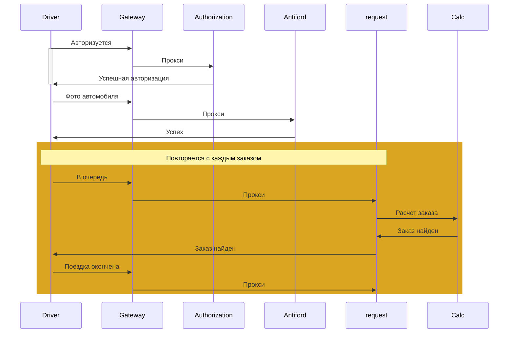
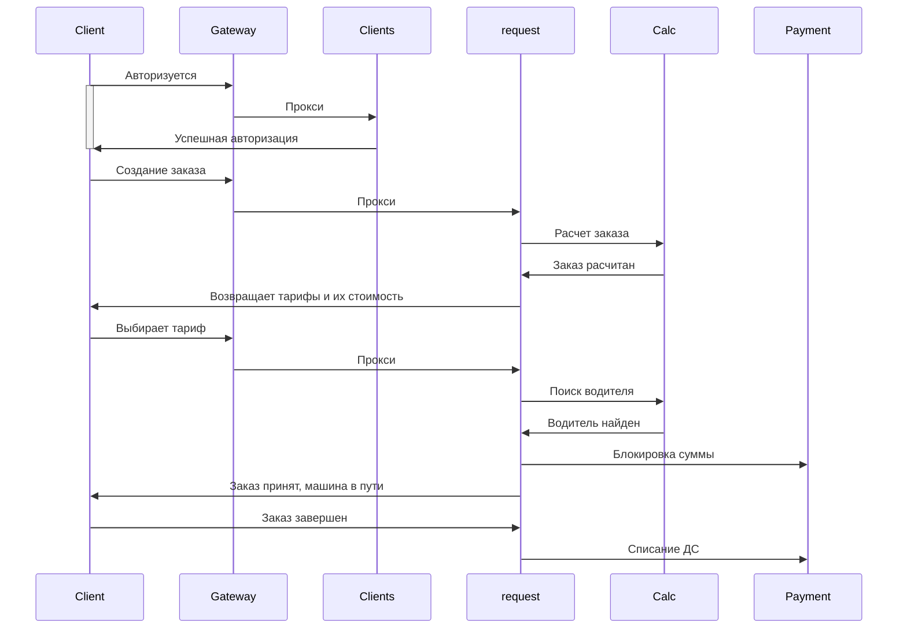

Такси

Общая архитектура сервисов

На схеме все взаимодействия между сервисами осуществляются по HTTP кроме взаимодействия с платежной системой, там асинхронно через брокер.

Диаграмма последовательности для водителя

Диаграмма последовательности для клиента

Stranger Gateway 

|этап   | кол-во участников	критерии отбора  | условия перехода на этап  |План на случаи проблем	   |   
|---|---|---|---|
| 1  | 10% клиентов |регионы отдаленные от центра(магадан, бурятия) |сервис готов, протестирова и задеплоен на прод, получены все зазрешения от ИТ, СБ и прочих	   | Откат изменений, оповещения клиентов о повторной попытке
| 2  | 60% клиентов   |Все регионы, кроме городов миллионников(Москва, Питер)   | Сутки без проблем   |Откат изменений, оповещения клиентов о повторной попытке
| 3  | 60% клиентов   | Все регионы  | Трое суток без проблем  |Откат изменений, оповещения клиентов о повторной попытке
| 4  | Отключение старого функционала   | Неделя без проблем |   |
