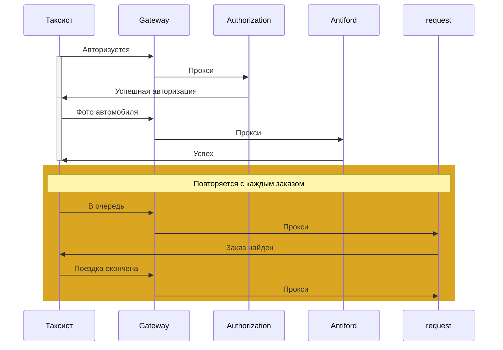

# Otus.Teaching.PromoCodeFactory

Проект для домашних заданий и демо по курсу `C# ASP.NET Core Разработчик` от `Отус`.
Cистема `Promocode Factory` для выдачи промокодов партнеров для клиентов по группам предпочтений.

cicd src/Otus.Teaching.PromoCodeFactory.sln

Подробное описание проекта можно найти в [Wiki](https://gitlab.com/devgrav/otus.teaching.promocodefactory/-/wikis/Home)

Описание домашнего задания в [Homework Wiki](https://gitlab.com/devgrav/otus.teaching.promocodefactory/-/wikis/Homework-1)
